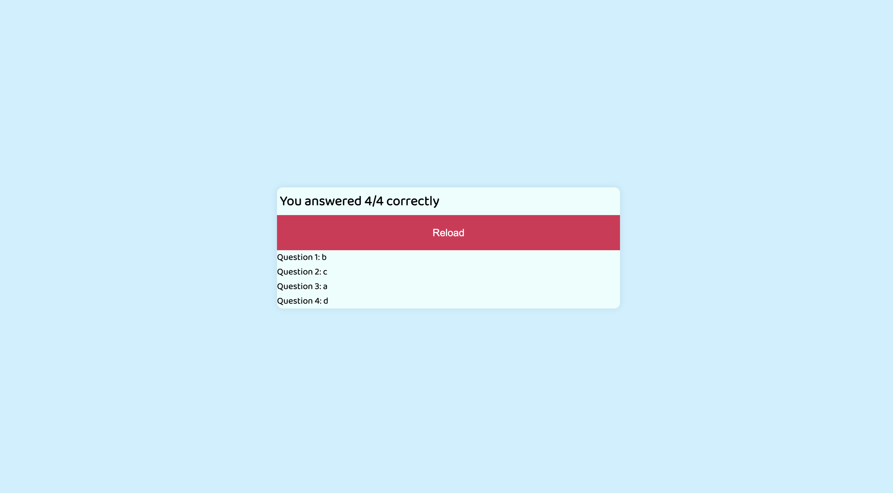

## Homework Assignment #4

### Overview:
- For this homework assignment, I was assigned to create a timed quiz generator using fundamental Javascript skills that will generate questions and answers so that when users chose their input, the quiz will display how many questions were correct and will also display their answer choices using local storage.

### Process:
- During my process of creating a quiz generator, I first created all the necessary variables that will be used within my code (e.g. created a variable contaning all the different type of questions and answers)
-Furthermore, I created numerous functions that will generate the questions and functions to correspond to the correct answers
-Lastly, the main function was invoked so that function will start once the page loads

### Additional Documents:
- link to my repo: https://github.com/paulwon2223/Quiz-Generator-Final-PW
- link to my git page: https://paulwon2223.github.io/Quiz-Generator-Final-PW/
- screen shot of quiz generator:

- screen shot of quiz generator results:

